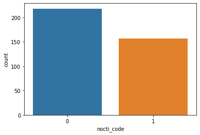

```python
import pandas as pd
import seaborn as sns
import matplotlib.pyplot as plt
from sklearn.ensemble import RandomForestClassifier
from sklearn.svm import SVC
from sklearn import svm
from sklearn.neural_network import MLPClassifier
from sklearn.metrics import confusion_matrix, classification_report
from sklearn.preprocessing import StandardScaler, LabelEncoder
from sklearn.model_selection import train_test_split
%matplotlib inline
```


```python
!pwd
```

    /Users/christianbamber


```python
mkdir tmp

```

    mkdir: tmp: File exists


```python
cd tmp
```

    /Users/christianbamber/tmp


```python
#import abbreviated dataset
df=pd.read_excel('l4_image5_noctiluca_iloc.xlsx')
```


```python
df.head()
```


<div>
<style scoped>
    .dataframe tbody tr th:only-of-type {
        vertical-align: middle;
    }

    .dataframe tbody tr th {
        vertical-align: top;
    }

    .dataframe thead th {
        text-align: right;
    }
</style>
<table border="1" class="dataframe">
  <thead>
    <tr style="text-align: right;">
      <th></th>
      <th>1</th>
      <th>2</th>
      <th>3</th>
      <th>4</th>
      <th>5</th>
      <th>6</th>
      <th>7</th>
      <th>8</th>
      <th>9</th>
      <th>10</th>
      <th>...</th>
      <th>45</th>
      <th>46</th>
      <th>47</th>
      <th>48</th>
      <th>49</th>
      <th>50</th>
      <th>51</th>
      <th>52</th>
      <th>53</th>
      <th>54</th>
    </tr>
  </thead>
  <tbody>
    <tr>
      <td>0</td>
      <td>id</td>
      <td>image_x</td>
      <td>image_y</td>
      <td>image_w</td>
      <td>image_h</td>
      <td>src_x</td>
      <td>src_y</td>
      <td>src_image</td>
      <td>cal_image</td>
      <td>ppc</td>
      <td>...</td>
      <td>intensity_calimage</td>
      <td>raw_convex_hull_area</td>
      <td>raw_filled_area</td>
      <td>filled_area</td>
      <td>feret_max_angle</td>
      <td>feret_min_angle</td>
      <td>NaN</td>
      <td>collage_file</td>
      <td>image_id</td>
      <td>noctiluca</td>
    </tr>
    <tr>
      <td>1</td>
      <td>1</td>
      <td>0</td>
      <td>0</td>
      <td>13</td>
      <td>146</td>
      <td>166</td>
      <td>51</td>
      <td>328</td>
      <td>1</td>
      <td>1</td>
      <td>...</td>
      <td>0</td>
      <td>767</td>
      <td>655</td>
      <td>41860.7</td>
      <td>-90</td>
      <td>0</td>
      <td>2019-11-13T14:53:38.724</td>
      <td>L4_13112019_run1_000001.tif</td>
      <td>C3E17025-77F4-4EEE-916C-E00EB50FE38E</td>
      <td>n</td>
    </tr>
    <tr>
      <td>2</td>
      <td>2</td>
      <td>15</td>
      <td>0</td>
      <td>77</td>
      <td>80</td>
      <td>864</td>
      <td>66</td>
      <td>329</td>
      <td>1</td>
      <td>1</td>
      <td>...</td>
      <td>0</td>
      <td>383</td>
      <td>223</td>
      <td>10743.5</td>
      <td>40</td>
      <td>-45</td>
      <td>2019-11-13T14:53:38.825</td>
      <td>L4_13112019_run1_000001.tif</td>
      <td>2CAA2D06-2722-47D6-AF38-98114A3056D1</td>
      <td>n</td>
    </tr>
    <tr>
      <td>3</td>
      <td>3</td>
      <td>94</td>
      <td>0</td>
      <td>58</td>
      <td>93</td>
      <td>452</td>
      <td>165</td>
      <td>329</td>
      <td>1</td>
      <td>1</td>
      <td>...</td>
      <td>0</td>
      <td>513.5</td>
      <td>201</td>
      <td>9311.07</td>
      <td>-55</td>
      <td>30</td>
      <td>2019-11-13T14:53:38.825</td>
      <td>L4_13112019_run1_000001.tif</td>
      <td>AB9D8EC6-2DAD-4FB0-AA2D-6A2ADC4290D7</td>
      <td>n</td>
    </tr>
    <tr>
      <td>4</td>
      <td>4</td>
      <td>154</td>
      <td>0</td>
      <td>38</td>
      <td>461</td>
      <td>150</td>
      <td>1236</td>
      <td>329</td>
      <td>1</td>
      <td>1</td>
      <td>...</td>
      <td>0</td>
      <td>4344</td>
      <td>1777</td>
      <td>130636</td>
      <td>-85</td>
      <td>5</td>
      <td>2019-11-13T14:53:38.825</td>
      <td>L4_13112019_run1_000001.tif</td>
      <td>242667D9-A247-4010-A43F-85CCB421A36A</td>
      <td>n</td>
    </tr>
  </tbody>
</table>
<p>5 rows × 54 columns</p>
</div>


```python
#remove columns which don't contribute to modelling directly
df.drop([1,2,3,4,5,6,7,8,9,10,11,12,13,14,15,16,17, 51, 52, 53], axis=1, inplace=True)
```


```python
df.head()
```


<div>
<style scoped>
    .dataframe tbody tr th:only-of-type {
        vertical-align: middle;
    }

    .dataframe tbody tr th {
        vertical-align: top;
    }

    .dataframe thead th {
        text-align: right;
    }
</style>
<table border="1" class="dataframe">
  <thead>
    <tr style="text-align: right;">
      <th></th>
      <th>18</th>
      <th>19</th>
      <th>20</th>
      <th>21</th>
      <th>22</th>
      <th>23</th>
      <th>24</th>
      <th>25</th>
      <th>26</th>
      <th>27</th>
      <th>...</th>
      <th>43</th>
      <th>44</th>
      <th>45</th>
      <th>46</th>
      <th>47</th>
      <th>48</th>
      <th>49</th>
      <th>50</th>
      <th>51</th>
      <th>54</th>
    </tr>
  </thead>
  <tbody>
    <tr>
      <td>0</td>
      <td>raw_area</td>
      <td>raw_feret_max</td>
      <td>raw_feret_min</td>
      <td>raw_feret_mean</td>
      <td>raw_perimeter</td>
      <td>raw_convex_perimeter</td>
      <td>raw_legendre_major</td>
      <td>raw_legendre_minor</td>
      <td>abd_area</td>
      <td>abd_diameter</td>
      <td>...</td>
      <td>symmetry</td>
      <td>circularity_hu</td>
      <td>intensity_calimage</td>
      <td>raw_convex_hull_area</td>
      <td>raw_filled_area</td>
      <td>filled_area</td>
      <td>feret_max_angle</td>
      <td>feret_min_angle</td>
      <td>NaN</td>
      <td>noctiluca</td>
    </tr>
    <tr>
      <td>1</td>
      <td>647</td>
      <td>142</td>
      <td>9</td>
      <td>91.6667</td>
      <td>372.652</td>
      <td>284.914</td>
      <td>146.923</td>
      <td>7.6436</td>
      <td>41255.4</td>
      <td>229.19</td>
      <td>...</td>
      <td>0.5029</td>
      <td>0.0771</td>
      <td>0</td>
      <td>767</td>
      <td>655</td>
      <td>41860.7</td>
      <td>-90</td>
      <td>0</td>
      <td>2019-11-13T14:53:38.724</td>
      <td>n</td>
    </tr>
    <tr>
      <td>2</td>
      <td>223</td>
      <td>105</td>
      <td>7</td>
      <td>67.5556</td>
      <td>215.505</td>
      <td>208.94</td>
      <td>107.622</td>
      <td>4.8217</td>
      <td>10743.5</td>
      <td>116.957</td>
      <td>...</td>
      <td>0.3763</td>
      <td>0.0489</td>
      <td>0</td>
      <td>383</td>
      <td>223</td>
      <td>10743.5</td>
      <td>40</td>
      <td>-45</td>
      <td>2019-11-13T14:53:38.825</td>
      <td>n</td>
    </tr>
    <tr>
      <td>3</td>
      <td>201</td>
      <td>104</td>
      <td>9</td>
      <td>66.8889</td>
      <td>220.492</td>
      <td>207.128</td>
      <td>108.251</td>
      <td>7.2237</td>
      <td>9311.07</td>
      <td>108.882</td>
      <td>...</td>
      <td>0.342</td>
      <td>0.0435</td>
      <td>0</td>
      <td>513.5</td>
      <td>201</td>
      <td>9311.07</td>
      <td>-55</td>
      <td>30</td>
      <td>2019-11-13T14:53:38.825</td>
      <td>n</td>
    </tr>
    <tr>
      <td>4</td>
      <td>1777</td>
      <td>458</td>
      <td>21</td>
      <td>292.444</td>
      <td>968.333</td>
      <td>915.64</td>
      <td>472.547</td>
      <td>14.8068</td>
      <td>130636</td>
      <td>407.837</td>
      <td>...</td>
      <td>0.4726</td>
      <td>0.0202</td>
      <td>0</td>
      <td>4344</td>
      <td>1777</td>
      <td>130636</td>
      <td>-85</td>
      <td>5</td>
      <td>2019-11-13T14:53:38.825</td>
      <td>n</td>
    </tr>
  </tbody>
</table>
<p>5 rows × 35 columns</p>
</div>


```python
#make row 0 = headers
new_header = df.iloc[0] 
df = df[1:]
df.columns = new_header
```


```python
df.head()
```


<div>
<style scoped>
    .dataframe tbody tr th:only-of-type {
        vertical-align: middle;
    }

    .dataframe tbody tr th {
        vertical-align: top;
    }

    .dataframe thead th {
        text-align: right;
    }
</style>
<table border="1" class="dataframe">
  <thead>
    <tr style="text-align: right;">
      <th></th>
      <th>raw_area</th>
      <th>raw_feret_max</th>
      <th>raw_feret_min</th>
      <th>raw_feret_mean</th>
      <th>raw_perimeter</th>
      <th>raw_convex_perimeter</th>
      <th>raw_legendre_major</th>
      <th>raw_legendre_minor</th>
      <th>abd_area</th>
      <th>abd_diameter</th>
      <th>...</th>
      <th>circle_fit</th>
      <th>symmetry</th>
      <th>circularity_hu</th>
      <th>intensity_calimage</th>
      <th>raw_convex_hull_area</th>
      <th>raw_filled_area</th>
      <th>filled_area</th>
      <th>feret_max_angle</th>
      <th>feret_min_angle</th>
      <th>noctiluca</th>
    </tr>
  </thead>
  <tbody>
    <tr>
      <td>1</td>
      <td>647</td>
      <td>142</td>
      <td>9</td>
      <td>91.6667</td>
      <td>372.652</td>
      <td>284.914</td>
      <td>146.923</td>
      <td>7.6436</td>
      <td>41255.4</td>
      <td>229.19</td>
      <td>...</td>
      <td>0</td>
      <td>0.5029</td>
      <td>0.0771</td>
      <td>0</td>
      <td>767</td>
      <td>655</td>
      <td>41860.7</td>
      <td>-90</td>
      <td>0</td>
      <td>n</td>
    </tr>
    <tr>
      <td>2</td>
      <td>223</td>
      <td>105</td>
      <td>7</td>
      <td>67.5556</td>
      <td>215.505</td>
      <td>208.94</td>
      <td>107.622</td>
      <td>4.8217</td>
      <td>10743.5</td>
      <td>116.957</td>
      <td>...</td>
      <td>0</td>
      <td>0.3763</td>
      <td>0.0489</td>
      <td>0</td>
      <td>383</td>
      <td>223</td>
      <td>10743.5</td>
      <td>40</td>
      <td>-45</td>
      <td>n</td>
    </tr>
    <tr>
      <td>3</td>
      <td>201</td>
      <td>104</td>
      <td>9</td>
      <td>66.8889</td>
      <td>220.492</td>
      <td>207.128</td>
      <td>108.251</td>
      <td>7.2237</td>
      <td>9311.07</td>
      <td>108.882</td>
      <td>...</td>
      <td>0</td>
      <td>0.342</td>
      <td>0.0435</td>
      <td>0</td>
      <td>513.5</td>
      <td>201</td>
      <td>9311.07</td>
      <td>-55</td>
      <td>30</td>
      <td>n</td>
    </tr>
    <tr>
      <td>4</td>
      <td>1777</td>
      <td>458</td>
      <td>21</td>
      <td>292.444</td>
      <td>968.333</td>
      <td>915.64</td>
      <td>472.547</td>
      <td>14.8068</td>
      <td>130636</td>
      <td>407.837</td>
      <td>...</td>
      <td>0</td>
      <td>0.4726</td>
      <td>0.0202</td>
      <td>0</td>
      <td>4344</td>
      <td>1777</td>
      <td>130636</td>
      <td>-85</td>
      <td>5</td>
      <td>n</td>
    </tr>
    <tr>
      <td>5</td>
      <td>442</td>
      <td>167</td>
      <td>9</td>
      <td>107.111</td>
      <td>361.823</td>
      <td>333.168</td>
      <td>181.221</td>
      <td>5.2739</td>
      <td>26027</td>
      <td>182.04</td>
      <td>...</td>
      <td>0</td>
      <td>0.1174</td>
      <td>0.0342</td>
      <td>0</td>
      <td>678</td>
      <td>442</td>
      <td>26027</td>
      <td>-90</td>
      <td>0</td>
      <td>n</td>
    </tr>
  </tbody>
</table>
<p>5 rows × 34 columns</p>
</div>


```python
#check for null values
df.info()
```

    <class 'pandas.core.frame.DataFrame'>
    RangeIndex: 375 entries, 1 to 375
    Data columns (total 34 columns):
    raw_area                375 non-null object
    raw_feret_max           375 non-null object
    raw_feret_min           375 non-null object
    raw_feret_mean          375 non-null object
    raw_perimeter           375 non-null object
    raw_convex_perimeter    375 non-null object
    raw_legendre_major      375 non-null object
    raw_legendre_minor      375 non-null object
    abd_area                375 non-null object
    abd_diameter            375 non-null object
    length                  375 non-null object
    width                   375 non-null object
    esd_diameter            375 non-null object
    fd_diameter             375 non-null object
    perimeter               375 non-null object
    convex_perimeter        375 non-null object
    intensity               375 non-null object
    sigma_intensity         375 non-null object
    sum_intensity           375 non-null object
    compactness             375 non-null object
    elongation              375 non-null object
    roughness               375 non-null object
    edge_gradient           375 non-null object
    elapsed_time            375 non-null object
    circle_fit              375 non-null object
    symmetry                375 non-null object
    circularity_hu          375 non-null object
    intensity_calimage      375 non-null object
    raw_convex_hull_area    375 non-null object
    raw_filled_area         375 non-null object
    filled_area             375 non-null object
    feret_max_angle         375 non-null object
    feret_min_angle         375 non-null object
    noctiluca               375 non-null object
    dtypes: object(34)
    memory usage: 99.7+ KB


```python
#convert yeses and nos under noctiluca column to 0 and 1
lb_nocti = LabelEncoder()
df["nocti_code"] = lb_nocti.fit_transform(df["noctiluca"])
df[["noctiluca", "nocti_code"]].head(200)
```


<div>
<style scoped>
    .dataframe tbody tr th:only-of-type {
        vertical-align: middle;
    }

    .dataframe tbody tr th {
        vertical-align: top;
    }

    .dataframe thead th {
        text-align: right;
    }
</style>
<table border="1" class="dataframe">
  <thead>
    <tr style="text-align: right;">
      <th></th>
      <th>noctiluca</th>
      <th>nocti_code</th>
    </tr>
  </thead>
  <tbody>
    <tr>
      <td>1</td>
      <td>n</td>
      <td>0</td>
    </tr>
    <tr>
      <td>2</td>
      <td>n</td>
      <td>0</td>
    </tr>
    <tr>
      <td>3</td>
      <td>n</td>
      <td>0</td>
    </tr>
    <tr>
      <td>4</td>
      <td>n</td>
      <td>0</td>
    </tr>
    <tr>
      <td>5</td>
      <td>n</td>
      <td>0</td>
    </tr>
    <tr>
      <td>...</td>
      <td>...</td>
      <td>...</td>
    </tr>
    <tr>
      <td>196</td>
      <td>y</td>
      <td>1</td>
    </tr>
    <tr>
      <td>197</td>
      <td>n</td>
      <td>0</td>
    </tr>
    <tr>
      <td>198</td>
      <td>n</td>
      <td>0</td>
    </tr>
    <tr>
      <td>199</td>
      <td>y</td>
      <td>1</td>
    </tr>
    <tr>
      <td>200</td>
      <td>y</td>
      <td>1</td>
    </tr>
  </tbody>
</table>
<p>200 rows × 2 columns</p>
</div>


```python
#remove original noctiluca column
df.drop('noctiluca', axis=1, inplace=True)
```


```python
df.head()
```


<div>
<style scoped>
    .dataframe tbody tr th:only-of-type {
        vertical-align: middle;
    }

    .dataframe tbody tr th {
        vertical-align: top;
    }

    .dataframe thead th {
        text-align: right;
    }
</style>
<table border="1" class="dataframe">
  <thead>
    <tr style="text-align: right;">
      <th></th>
      <th>raw_area</th>
      <th>raw_feret_max</th>
      <th>raw_feret_min</th>
      <th>raw_feret_mean</th>
      <th>raw_perimeter</th>
      <th>raw_convex_perimeter</th>
      <th>raw_legendre_major</th>
      <th>raw_legendre_minor</th>
      <th>abd_area</th>
      <th>abd_diameter</th>
      <th>...</th>
      <th>circle_fit</th>
      <th>symmetry</th>
      <th>circularity_hu</th>
      <th>intensity_calimage</th>
      <th>raw_convex_hull_area</th>
      <th>raw_filled_area</th>
      <th>filled_area</th>
      <th>feret_max_angle</th>
      <th>feret_min_angle</th>
      <th>nocti_code</th>
    </tr>
  </thead>
  <tbody>
    <tr>
      <td>1</td>
      <td>647</td>
      <td>142</td>
      <td>9</td>
      <td>91.6667</td>
      <td>372.652</td>
      <td>284.914</td>
      <td>146.923</td>
      <td>7.6436</td>
      <td>41255.4</td>
      <td>229.19</td>
      <td>...</td>
      <td>0</td>
      <td>0.5029</td>
      <td>0.0771</td>
      <td>0</td>
      <td>767</td>
      <td>655</td>
      <td>41860.7</td>
      <td>-90</td>
      <td>0</td>
      <td>0</td>
    </tr>
    <tr>
      <td>2</td>
      <td>223</td>
      <td>105</td>
      <td>7</td>
      <td>67.5556</td>
      <td>215.505</td>
      <td>208.94</td>
      <td>107.622</td>
      <td>4.8217</td>
      <td>10743.5</td>
      <td>116.957</td>
      <td>...</td>
      <td>0</td>
      <td>0.3763</td>
      <td>0.0489</td>
      <td>0</td>
      <td>383</td>
      <td>223</td>
      <td>10743.5</td>
      <td>40</td>
      <td>-45</td>
      <td>0</td>
    </tr>
    <tr>
      <td>3</td>
      <td>201</td>
      <td>104</td>
      <td>9</td>
      <td>66.8889</td>
      <td>220.492</td>
      <td>207.128</td>
      <td>108.251</td>
      <td>7.2237</td>
      <td>9311.07</td>
      <td>108.882</td>
      <td>...</td>
      <td>0</td>
      <td>0.342</td>
      <td>0.0435</td>
      <td>0</td>
      <td>513.5</td>
      <td>201</td>
      <td>9311.07</td>
      <td>-55</td>
      <td>30</td>
      <td>0</td>
    </tr>
    <tr>
      <td>4</td>
      <td>1777</td>
      <td>458</td>
      <td>21</td>
      <td>292.444</td>
      <td>968.333</td>
      <td>915.64</td>
      <td>472.547</td>
      <td>14.8068</td>
      <td>130636</td>
      <td>407.837</td>
      <td>...</td>
      <td>0</td>
      <td>0.4726</td>
      <td>0.0202</td>
      <td>0</td>
      <td>4344</td>
      <td>1777</td>
      <td>130636</td>
      <td>-85</td>
      <td>5</td>
      <td>0</td>
    </tr>
    <tr>
      <td>5</td>
      <td>442</td>
      <td>167</td>
      <td>9</td>
      <td>107.111</td>
      <td>361.823</td>
      <td>333.168</td>
      <td>181.221</td>
      <td>5.2739</td>
      <td>26027</td>
      <td>182.04</td>
      <td>...</td>
      <td>0</td>
      <td>0.1174</td>
      <td>0.0342</td>
      <td>0</td>
      <td>678</td>
      <td>442</td>
      <td>26027</td>
      <td>-90</td>
      <td>0</td>
      <td>0</td>
    </tr>
  </tbody>
</table>
<p>5 rows × 34 columns</p>
</div>


```python
#check counts of each code
df['nocti_code'].value_counts()
```


    0    218
    1    157
    Name: nocti_code, dtype: int64


```python
#histo for fun
sns.countplot(df['nocti_code'])
```


    <matplotlib.axes._subplots.AxesSubplot at 0x1a238e5450>





```python
#separate dataset as response variable and feature variables
X=df.drop('nocti_code', axis=1)
y=df['nocti_code']
```


```python
#train and test splitting of data
X_train, X_test, y_train, y_test = train_test_split(X, y, test_size = 0.2, random_state=42)
```


```python
#apply standard scaling
sc = StandardScaler()
X_train = sc.fit_transform(X_train)
X_test = sc.transform(X_test)
```


```python
#random forest classifier
rfc = RandomForestClassifier(n_estimators=200)
rfc.fit(X_train, y_train)
pred_rfc = rfc.predict(X_test)
```


```python
pred_rfc[:20]
```


    array([1, 0, 0, 1, 0, 1, 0, 0, 1, 0, 1, 0, 1, 0, 1, 1, 0, 1, 1, 0])


```python
#performance
print(classification_report(y_test, pred_rfc))
```

                  precision    recall  f1-score   support
    
               0       1.00      1.00      1.00        47
               1       1.00      1.00      1.00        28
    
        accuracy                           1.00        75
       macro avg       1.00      1.00      1.00        75
    weighted avg       1.00      1.00      1.00        75
    


```python
print(confusion_matrix(y_test, pred_rfc))
```

    [[47  0]
     [ 0 28]]


```python

```
